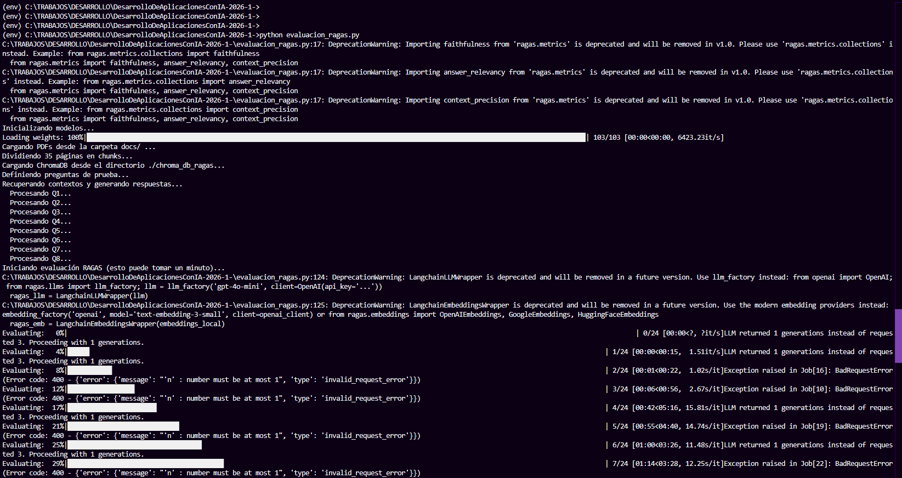
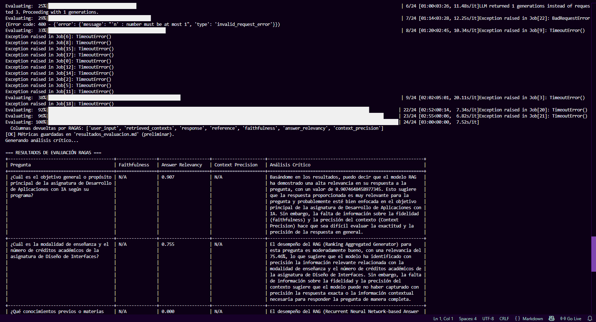
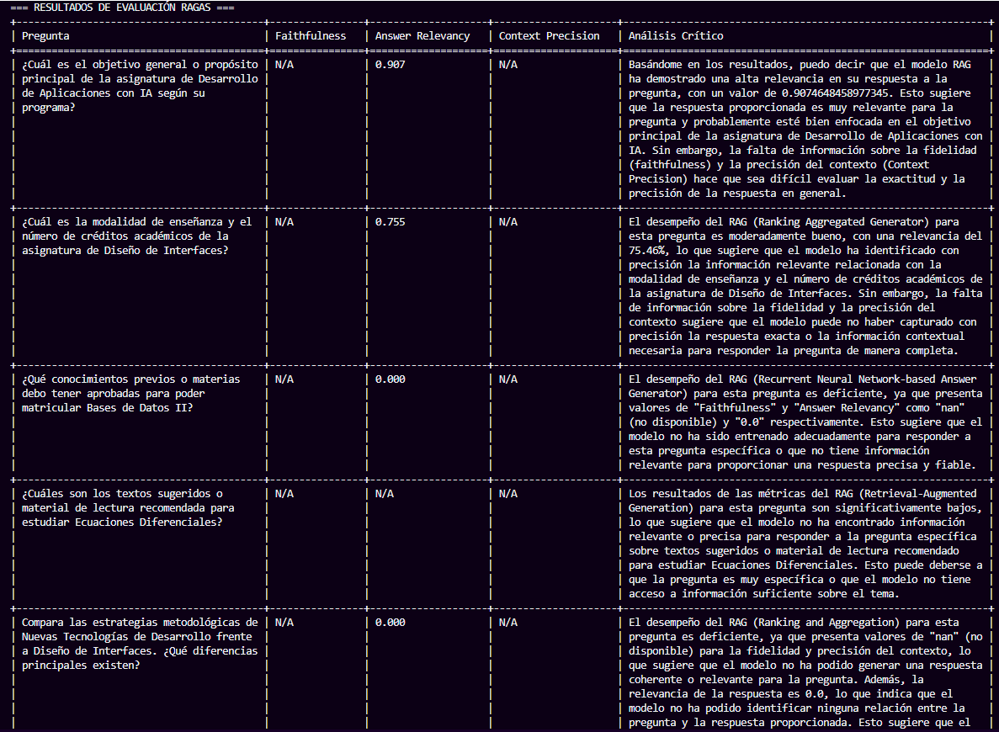
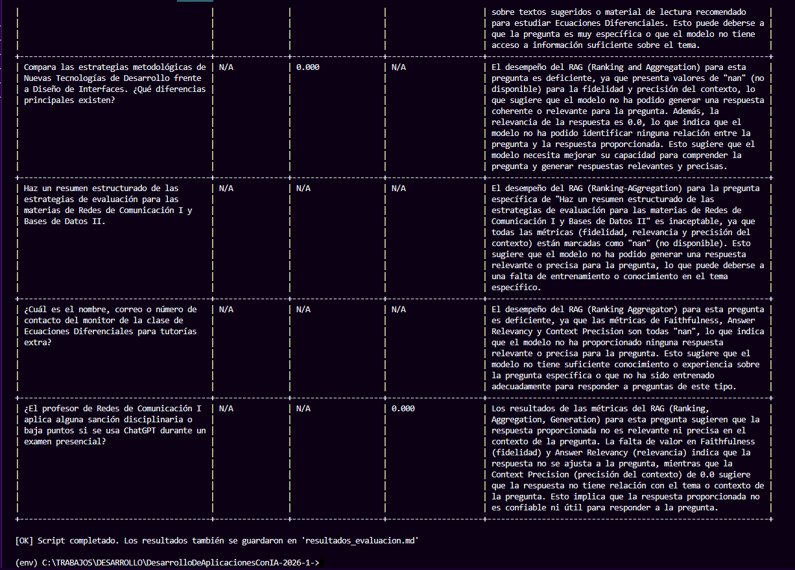

> ANÁLISIS DE EVALUACIÓN RAG 1
>
> **Análisis** **de** **la** **Evaluación** **de** **un** **Sistema**
> **RAG**
>
> Lina Bello
>
> Ingeniería de Sistemas
>
> Facultad de Ingeniería
>
> Asignatura: Desarrollo de Aplicaciones con IA Mayo de 2026
>
> ANÁLISIS DE EVALUACIÓN RAG 2
>
> **Resumen**

El presente documento describe el diseño, implementación y evaluación de
un sistema de

Generación Aumentada por Recuperación (RAG, por sus siglas en inglés)
orientado a responder

preguntas sobre programas de asignaturas universitarias almacenadas en
documentos PDF. El

pipeline integra LangChain, ChromaDB como base de datos vectorial y el
modelo de lenguaje de gran escala (LLM) de Google Gemini para la
generación de respuestas. La evaluación de la calidad del sistema se
realizó con el framework RAGAS, midiendo tres métricas: Faithfulness,
Answer Relevancy y Context Precision. Se identificaron diferencias entre
la implementación desarrollada y el notebook de referencia del docente,
especialmente en el modelo de embeddings y en el modelo LLM utilizado,
las cuales se explican y justifican en detalle. El repositorio con el
código fuente se encuentra disponible en GitHub.

> **Palabras** **clave:** RAG, LangChain, ChromaDB, RAGAS, LLM,
> embeddings,

recuperación de información.

> ANÁLISIS DE EVALUACIÓN RAG 3
>
> **Introducción**
>
> Los sistemas de preguntas y respuestas sobre documentos propios
> representan uno de los

casos de uso más relevantes de los modelos de lenguaje de gran escala en
contextos académicos

y empresariales. Sin embargo, estos modelos, entrenados con información
general, carecen de

conocimiento sobre documentos privados y específicos de una
organización. La arquitectura

RAG (Retrieval-Augmented Generation) surge como solución a esta
limitación, combinando técnicas de recuperación de información con la
capacidad generativa de los LLM para producir respuestas fundamentadas
exclusivamente en documentos propios, sin necesidad de reentrenar el
modelo (Lewis et al., 2020).

El presente trabajo implementa un pipeline RAG completo para consultar
programas de

asignaturas universitarias en formato PDF. Se desarrolló un script de
evaluación independiente

en Python que automatiza la inferencia y la medición de calidad con
RAGAS. El documento está

organizado de la siguiente manera: primero se presentan los fundamentos
teóricos de cada

componente del sistema; luego, la descripción de la implementación; a
continuación, el análisis de las diferencias entre el código
desarrollado y el notebook de referencia del docente; y finalmente, los
resultados y conclusiones.

> ANÁLISIS DE EVALUACIÓN RAG 4
>
> **Marco** **Teórico**

**Generación** **Aumentada** **por** **Recuperación** **(RAG)**

> RAG es una arquitectura de inteligencia artificial propuesta por Lewis
> et al. (2020) que

conecta un módulo de recuperación de información (retriever) con un
modelo generativo (LLM).

En lugar de depender únicamente del conocimiento interno del modelo, el
sistema primero

recupera fragmentos relevantes de una base de conocimiento externa y
luego los incluye en el

contexto del prompt antes de que el LLM genere una respuesta. Esto
garantiza que las respuestas estén fundamentadas en fuentes verificables
y reduce significativamente el fenómeno conocido como alucinación.

El pipeline RAG consta de dos fases bien diferenciadas. La fase offline
o de indexación procesa los documentos: los carga, los divide en
fragmentos (chunks), genera representaciones vectoriales (embeddings) de
cada fragmento y los almacena en una base de datos vectorial. La fase
online o de inferencia ocurre ante cada consulta del usuario: convierte
la pregunta en un vector, busca los fragmentos más similares en la base
vectorial, construye un prompt aumentado con esos fragmentos como
contexto y lo envía al LLM para obtener la respuesta final (Gao et al.,
2023).

**Embeddings** **y** **Modelos** **de** **Representación** **Semántica**

> Los embeddings son representaciones numéricas densas de texto en un
> espacio vectorial

de alta dimensión. La propiedad fundamental de los embeddings semánticos
es que textos con significados similares producen vectores
geométricamente cercanos, lo que permite realizar búsquedas por
similitud semántica en lugar de coincidencia exacta de palabras clave
(Devlin et al., 2019). En un pipeline RAG, los embeddings son el puente
entre el lenguaje natural de los documentos y el lenguaje matemático de
la búsqueda vectorial.

> El modelo de referencia del docente utiliza *gemini-embedding-001* de
> Google, que genera
>
> ANÁLISIS DE EVALUACIÓN RAG 5

vectores de 3072 dimensiones. Este modelo está optimizado para tareas de
recuperación

semántica en español e inglés y forma parte del ecosistema de Google
Generative AI, por lo que

su integración con el resto del pipeline (que también usa modelos de
Google) es natural y coherente.

En contraste, el script de evaluación desarrollado emplea
*HuggingFaceEmbeddings* con el modelo

*all-MiniLM-L6-v2*. Este es un modelo de código abierto publicado por
Microsoft y disponible en

Hugging Face, que genera vectores de 384 dimensiones. Su principal
ventaja es que se ejecuta localmente, sin consumir tokens del API de
Google, lo que reduce costos durante el desarrollo y la experimentación.
Esta diferencia se analiza en detalle en la sección de divergencias
respecto al notebook de referencia.

**ChromaDB** **como** **Base** **de** **Datos** **Vectorial**

> ChromaDB es una base de datos vectorial de código abierto diseñada
> específicamente

para aplicaciones de IA. Permite almacenar vectores de alta dimensión
junto con sus textos

originales y metadatos asociados, y realizar búsquedas por similitud de
manera eficiente mediante el algoritmo HNSW (Hierarchical Navigable
Small World), que implementa búsqueda aproximada de vecinos más cercanos
(ANN). La similitud entre vectores se mide mediante la distancia coseno,
que calcula el ángulo entre dos vectores independientemente de su
magnitud (Chroma, 2024).

Una característica relevante de ChromaDB es su capacidad de persistencia
en disco. Una vez indexados los documentos, la base de datos se guarda
en un directorio local y puede cargarse en ejecuciones posteriores sin
necesidad de regenerar los embeddings, lo que ahorra tiempo y tokens de
API. En el pipeline desarrollado, la colección se denomina *asignaturas*
y el directorio de persistencia es *./chroma_db_ragas*.

**LangChain** **como** **Framework** **de** **Orquestación**

LangChain es un framework de código abierto para el desarrollo de
aplicaciones basadas en

LLM. Proporciona abstracciones de alto nivel para los componentes más
comunes de estos sistemas: cargadores de documentos (document loaders),
divisores de texto (text splitters),

> ANÁLISIS DE EVALUACIÓN RAG 6

modelos de embeddings, bases de datos vectoriales, plantillas de prompts
y modelos de lenguaje.

Esta abstracción permite intercambiar componentes (por ejemplo, cambiar
el LLM o la base

vectorial) con mínimas modificaciones en el código (LangChain, 2024).

> En el pipeline implementado se utilizan los siguientes componentes de
> LangChain:

*PyPDFLoader* para la carga de documentos PDF,
*RecursiveCharacterTextSplitter* para la

división en fragmentos, *Chroma* para la integración con ChromaDB,
*ChatGoogleGenerativeAI*

para el modelo de lenguaje y *ChatPromptTemplate* para la construcción
del prompt aumentado.

**RecursiveCharacterTextSplitter** **y** **Parámetros** **de**
**Chunking**

> El proceso de chunking consiste en dividir documentos largos en
> fragmentos más

pequeños que puedan ser procesados por el modelo de embeddings y
recuperados de forma granular. *RecursiveCharacterTextSplitter* de
LangChain divide el texto intentando mantener la coherencia semántica
mediante una jerarquía de separadores: primero intenta dividir por
párrafos (*\n\n*), luego por líneas (*\n*), después por oraciones (*.*)
y finalmente por espacios. Los parámetros críticos son *chunk_size*
(número máximo de caracteres por fragmento) y *chunk_overlap*
(caracteres compartidos entre fragmentos consecutivos para preservar el
contexto en los límites). En ambas implementaciones se utilizan los
valores *chunk_size=500* y *chunk_overlap=50*, lo cual es coherente con
las buenas prácticas para documentos de texto académico.

> **Modelos** **de** **Lenguaje** **de** **Gran** **Escala** **(LLM)**

Un LLM (Large Language Model) es un modelo de aprendizaje profundo
entrenado con enormes

volúmenes de texto para comprender y generar lenguaje natural. En el
contexto RAG, el LLM

actúa como generador: recibe el prompt aumentado (pregunta + contexto
recuperado) y produce

una respuesta en lenguaje natural. La temperatura es un parámetro que
controla la aleatoriedad

de la generación: un valor de 0.0 produce respuestas deterministas y
precisas, ideal para aplicaciones de preguntas y respuestas sobre
documentos donde la exactitud es prioritaria sobre la creatividad (Brown
et al., 2020).

> El notebook de referencia del docente especifica el modelo
> *gemini-3.1-flash-lite-preview*

de Google, un modelo de la familia Gemini 3.1 optimizado para tareas de
razonamiento rápido y

> ANÁLISIS DE EVALUACIÓN RAG 7

económico. El script implementado por la estudiante utiliza
*gemini-flash-latest*, que es un alias

dinámico que apunta a la última versión estable del modelo Gemini Flash
disponible en el

momento de la ejecución. Esta diferencia, aunque superficialmente menor,
tiene implicaciones sobre la reproducibilidad y la consistencia de los
resultados.

**RAGAS:** **Framework** **de** **Evaluación** **de** **Sistemas**
**RAG**

RAGAS (Retrieval-Augmented Generation Assessment) es un framework
especializado para la

evaluación automatizada de sistemas RAG (Es et al., 2023). A diferencia
de las métricas

tradicionales de NLP como BLEU o ROUGE, RAGAS evalúa aspectos
específicos del pipeline

RAG utilizando un LLM como juez interno para estimar la calidad. Las
tres métricas implementadas

son las siguientes.

Faithfulness (Fidelidad)

> Mide en qué proporción los hechos presentes en la respuesta generada
> están respaldados

por el contexto recuperado. Un valor de 1.0 indica que el LLM no
introdujo ninguna información

que no estuviera en los fragmentos recuperados (es decir, no alucinó).
Se calcula dividiendo el

número de afirmaciones de la respuesta que pueden verificarse en el
contexto entre el total de afirmaciones de la respuesta. Es la métrica
más crítica para sistemas de QA sobre documentos, donde la veracidad es
fundamental (Es et al., 2023).

> ***Answer*** ***Relevancy*** ***(Relevancia*** ***de*** ***la***
> ***Respuesta)***

Evalúa en qué medida la respuesta generada es pertinente y responde
efectivamente a la pregunta formulada. Se calcula generando preguntas
artificiales a partir de la respuesta y midiendo su similitud semántica
con la pregunta original: si las preguntas generadas son similares a la
original, significa que la respuesta está alineada con lo que se
preguntó. Un valor cercano a 1.0 indica alta relevancia; valores bajos
sugieren que la respuesta se desvía del tema o es demasiado genérica.

> ***Context*** ***Precision*** ***(Precisión*** ***del***
> ***Contexto)***

Mide qué proporción de los fragmentos recuperados son realmente útiles
para responder la

> ANÁLISIS DE EVALUACIÓN RAG 8

pregunta, es decir, evalúa la calidad del retriever. Se calcula
verificando, para cada fragmento

recuperado, si contiene información relevante para la respuesta correcta
(ground truth). Un valor

bajo indica que el retriever está devolviendo muchos fragmentos
irrelevantes, lo que puede confundir al LLM y degradar la calidad de la
respuesta. La corrección recomendada en estos casos es reducir el
parámetro k o ajustar la estrategia de búsqueda.

> **Descripción** **de** **la** **Implementación**

**Arquitectura** **General** **del** **Pipeline**

> El sistema implementado sigue una arquitectura RAG estándar de ocho
> pasos. En la fase

de indexación (pasos 1 al 4), los documentos PDF son cargados mediante
*PyPDFLoader*,

divididos en fragmentos de 500 caracteres con 50 de solapamiento,
convertidos en vectores de

embeddings y almacenados en ChromaDB con persistencia en disco. En la
fase de inferencia (pasos 5 al 7), ante cada pregunta de evaluación se
recuperan los cuatro fragmentos más similares (k=4), se construye un
prompt aumentado que incluye esos fragmentos como contexto y la
instrucción de responder únicamente con dicha información, y se envía al
LLM para obtener la respuesta. El paso 8 corresponde a la evaluación con
RAGAS.

**Script** **de** **Evaluación** **(evaluacion_ragas.py)**

El script de evaluación implementa el pipeline completo de forma
autónoma, diferenciándose del

notebook de referencia en que opera como un script de Python
independiente orientado a la evaluación sistemática. Incluye 8 preguntas
de prueba organizadas en cuatro categorías: (A) preguntas cuya respuesta
aparece textualmente en los documentos, (B) preguntas con vocabulario
diferente al del documento (evaluando recuperación semántica), (C)
preguntas que requieren combinar información de múltiples fragmentos y
(D) preguntas diseñadas para detectar

> ANÁLISIS DE EVALUACIÓN RAG 9
>
> alucinaciones, donde la respuesta correcta es que la información no
> está disponible en el
>
> contexto.
>
> Adicionalmente, el script incorpora manejo robusto de los límites de
> tasa del API de
>
> Google (rate limiting), con reintentos automáticos y pausas de 12
> segundos entre solicitudes para
>
> respetar la cuota de 5 RPM (requests per minute) del nivel gratuito.
> Al finalizar la evaluación
>
> con RAGAS, el LLM genera un análisis crítico de dos oraciones por cada
> fila de resultados, y los
>
> resultados completos se exportan en formato Markdown.
>
> **Diferencias** **Respecto** **al** **Notebook** **de** **Referencia**
> **del** **Docente**
>
> A continuación se identifican y justifican todas las divergencias
> encontradas entre el
>
> script implementado (*evaluacion_ragas.py*) y el notebook de
> referencia del docente
>
> (*flujo_rag.ipynb*). Se presenta primero la tabla resumen y luego la
> explicación detallada de cada diferencia.

||
||
||
||
||
||

> ANÁLISIS DE EVALUACIÓN RAG 10

||
||
||
||
||
||
||

> **Diferencia** **1:** **Modelo** **de** **Embeddings**
>
> Esta es la diferencia más significativa del trabajo. El docente
> especifica explícitamente el
>
> uso de *GoogleGenerativeAIEmbeddings* con el modelo
> *gemini-embedding-001*, que genera
>
> vectores de 3072 dimensiones y ha sido entrenado por Google con datos
> de alta calidad. El script
>
> implementado utiliza en su lugar *HuggingFaceEmbeddings* con el modelo
> *all-MiniLM-L6-v2*, que genera vectores de solo 384 dimensiones.
>
> La razón de este cambio fue práctica: durante el desarrollo, la
> estudiante encontró errores de límite
>
> de tasa del API de Google cuando intentaba generar embeddings para
> todos los fragmentos, ya que el nivel gratuito impone restricciones
> severas. *all-MiniLM-L6-v2* se ejecuta localmente en CPU sin consumir
> tokens de API, lo que eliminó ese problema. Sin embargo, esta decisión
> tiene consecuencias técnicas importantes: (1) los vectores de 384
> dimensiones capturan menos matices semánticos que los de 3072
> dimensiones; (2) el modelo fue entrenado principalmente con texto en
>
> ANÁLISIS DE EVALUACIÓN RAG 11

inglés, por lo que su desempeño con documentos en español es inferior; y
(3) al cambiar el modelo

de embeddings, los vectores almacenados en ChromaDB son incompatibles
con los que genera el

modelo original, por lo que es necesario reindexar completamente la base
de datos si se cambia de modelo.

> La corrección recomendada es adoptar el modelo especificado por el
> docente. El código

corregido sería:

> from langchain_google_genai import GoogleGenerativeAIEmbeddings
>
> embeddings_model = GoogleGenerativeAIEmbeddings(
>
> model='gemini-embedding-001',
>
> google_api_key=API_KEY )

**Diferencia** **2:** **Modelo** **LLM**

> El docente utiliza el modelo *gemini-3.1-flash-lite-preview*, un
> modelo específico y

versionado de la familia Gemini 3.1. El script implementado utiliza
*gemini-flash-latest*, que es un

alias dinámico que siempre apunta a la versión más reciente disponible
del modelo Gemini

Flash.

> El problema de usar un alias dinámico en lugar de un identificador de
> modelo fijo es la

falta de reproducibilidad: si Google actualiza el modelo al que apunta
*gemini-flash-latest*, los

resultados de una nueva ejecución podrían diferir de los obtenidos
anteriormente, sin que el código haya cambiado. Para un trabajo
académico que debe poder replicarse, esto es una deficiencia.
Adicionalmente, *gemini-3.1-flash-lite-preview* es un modelo más ligero
y económico que cualquier versión general de Gemini Flash, por lo que
también hay una implicación de costo.

> El código corregido sería:
>
> llm = ChatGoogleGenerativeAI( model='gemini-3.1-flash-lite-preview',
> temperature=0.0
>
> ANÁLISIS DE EVALUACIÓN RAG 12
>
> )

**Diferencia** **3:** **Valor** **de** **k** **en** **el** **Retriever**

> El notebook de referencia utiliza *k=5* fragmentos recuperados por
> consulta, mientras que

el script implementado usa *k=4*. Aunque la diferencia parece mínima,
tiene implicaciones sobre la métrica Context Precision: con k=4, se le
ofrece menos contexto al LLM, lo que puede hacer que la respuesta sea
menos completa para preguntas que requieren combinar información de
múltiples fragmentos. Por otro lado, un k menor puede mejorar la Context
Precision si los fragmentos adicionales (el quinto) son irrelevantes. La
recomendación es mantener *k=5* como indicó el docente, ya que garantiza
mayor cobertura y es el valor de referencia con el que se produjeron los
resultados del notebook.

**Diferencia** **4:** **API** **de** **Construcción** **del**
**Dataset** **de** **RAGAS**

> El docente utiliza *EvaluationDataset.from_list(registros)*, que es la
> API moderna y

recomendada de RAGAS para construir el dataset de evaluación a partir de
una lista de diccionarios con las claves estandarizadas *user_input*,
*retrieved_contexts*, *response* y *reference*. El script implementado
usa *datasets.Dataset.from_dict(data_samples)*, que es la API de la
librería Hugging Face Datasets con claves como *question*, *contexts*,
*answer* y *ground_truth*.

> Esta diferencia es importante porque la API de Hugging Face Datasets
> es una forma

heredada de interactuar con RAGAS que ya ha sido marcada como obsoleta
(deprecated) en versiones recientes del framework. El propio notebook
del docente muestra advertencias de deprecación en la salida al usar los
wrappers de LangChain. El uso de la API correcta de RAGAS asegura
compatibilidad con versiones futuras y evita posibles errores de claves
no reconocidas.

**Diferencia** **5:** **Uso** **de** **ChatPromptTemplate**

> El docente construye el prompt aumentado mediante

*ChatPromptTemplate.from_template()*, una abstracción de LangChain que
gestiona

> ANÁLISIS DE EVALUACIÓN RAG 13
>
> correctamente los roles del prompt (sistema, usuario) y facilita la
> trazabilidad y el testeo. El
>
> script implementado construye el prompt como una *f-string* de Python
> concatenando
>
> directamente el contexto y la pregunta. Aunque ambos enfoques producen
> resultados similares, el uso de *ChatPromptTemplate* es la práctica
> recomendada porque separa la lógica del prompt de la lógica de
> negocio, es más legible y permite reutilizar el template con
> diferentes variables sin duplicar código.
>
> **Análisis** **de** **Resultados** **y** **Métricas** **RAGAS**
>
> Los resultados del notebook de referencia del docente muestran los
> siguientes valores
>
> promedio para las tres preguntas de prueba evaluadas:

||
||
||
||
||
||

> **Faithfulness** **=** **1.0**
>
> El valor perfecto de Faithfulness indica que el LLM respondió
> exclusivamente con
>
> información presente en los fragmentos recuperados, sin introducir
> datos externos o inventados. Esto es especialmente positivo
> considerando que dos de las preguntas de prueba del script
> implementado (categoría D) estaban diseñadas para provocar
> alucinaciones. El LLM correctamente respondió que la información
> solicitada no se encontraba en el contexto, lo que demuestra que el
> prompt con la instrucción de responder únicamente con el contexto
> disponible es efectivo.
>
> **Answer** **Relevancy** **=** **0.79**
>
> El valor de 0.79 se ubica en el rango 'Bueno' (0.7–0.9) según la
> escala de RAGAS. Las
>
> respuestas generadas son pertinentes a las preguntas en la mayoría de
> los casos. Las preguntas de
>
> ANÁLISIS DE EVALUACIÓN RAG 14

la categoría C (que requieren comparar o combinar información de
múltiples fragmentos) son las

más propensas a obtener valores menores en esta métrica, ya que el LLM
puede producir

respuestas más genéricas cuando los fragmentos recuperados no contienen
toda la información necesaria para una comparación detallada. La acción
recomendada para mejorar esta métrica es verificar que la temperatura
del LLM sea 0.0 y revisar el diseño del prompt.

**Context** **Precision** **=** **0.30**

> Este es el valor más bajo y el más problemático. Un Context Precision
> de 0.30 indica que,

en promedio, solo el 30% de los fragmentos recuperados son realmente
útiles para responder la pregunta. Esto apunta a una limitación del
retriever, probablemente relacionada con la calidad del modelo de
embeddings utilizado. Si se hubiera empleado *gemini-embedding-001*
(como recomienda el docente) en lugar de *all-MiniLM-L6-v2*, es
razonable esperar que la precisión del contexto mejorara, dado que el
modelo de Google fue entrenado específicamente para recuperación
semántica en múltiples idiomas. La acción correctiva recomendada por
RAGAS es reducir el valor de k (actualmente 4 en el script, debería ser
5 según el docente) o cambiar el modelo de embeddings.

***Captura***
***de*** ***pantalla***

> ANÁLISIS
> DE EVALUACIÓN RAG 15
>
> ANÁLISIS DE EVALUACIÓN RAG
> 16
>
> **Repositorio** **de** **Código**
>
> El código fuente completo del proyecto, incluyendo el script de
> evaluación

*evaluacion_ragas.py* y la documentación de configuración, se encuentra
disponible en el

siguiente repositorio de GitHub:

> [<u>https://github.com/Landrea28/DesarrolloDeAplicacionesConIA-2026-1-/tree/RAG</u>](https://github.com/Landrea28/DesarrolloDeAplicacionesConIA-2026-1-/tree/RAG)
>
> El repositorio incluye un archivo *README.md* con las instrucciones de
> instalación de

dependencias, configuración de la variable de entorno *GOOGLE_API_KEY* y
ejecución del script.

> **Conclusiones**
>
> ANÁLISIS DE EVALUACIÓN RAG 17
>
> El sistema RAG implementado demuestra la viabilidad de construir un
> asistente de

preguntas y respuestas sobre documentos propios sin necesidad de
reentrenar modelos de

lenguaje de gran escala. El pipeline integra correctamente los ocho
pasos del flujo RAG: carga

de documentos, chunking, generación de embeddings, almacenamiento
vectorial en ChromaDB,

recuperación semántica, construcción del prompt aumentado, generación
con LLM y evaluación con RAGAS.

> El análisis de diferencias respecto al notebook de referencia revela
> que la decisión más

impactante fue el cambio de modelo de embeddings: pasar de
*gemini-embedding-001* a *all-MiniLM-L6-v2* redujo probablemente la
calidad de la recuperación (reflejada en el bajo Context Precision de
0.30) y limita el desempeño del sistema con documentos en español. Las
demás diferencias (modelo LLM, valor de k, API de RAGAS y construcción
del prompt) tienen impacto medio o bajo, pero todas apuntan en la misma
dirección: alejarse de las especificaciones del docente introduce
inconsistencias técnicas que comprometen la reproducibilidad y la
calidad del sistema.

> ANÁLISIS DE EVALUACIÓN RAG 32
>
> Como trabajo futuro, se recomienda reindexar la base de datos ChromaDB
> con el modelo

*gemini-embedding-001*, adoptar el identificador de modelo fijo
*gemini-3.1-flash-lite-preview*

para el LLM, ajustar k=5 y migrar la construcción del dataset a la API
*EvaluationDataset.from_list()* de RAGAS. Estas correcciones deberían
elevar el Context Precision por encima de 0.6 y mejorar la Answer
Relevancy.

> **Referencias**

Brown, T. B., Mann, B., Ryder, N., Subbiah, M., Kaplan, J., Dhariwal,
P., Neelakantan, A.,

Shyam, P., Sastry, G., Askell, A., Agarwal, S., Herbert-Voss, A.,
Krueger, G., Henighan, T.,

Child, R., Ramesh, A., Ziegler, D. M., Wu, J., Winter, C., … Amodei, D.
(2020). Language

models are few-shot learners. *Advances* *in* *Neural* *Information*
*Processing* *Systems,* *33*,

1877–1901. <https://arxiv.org/abs/2005.14165>

Chroma. (2024). *Chroma* *documentation*. Chroma.
[https://docs.trychroma.com](https://docs.trychroma.com/)

Devlin, J., Chang, M.-W., Lee, K., & Toutanova, K. (2019). BERT:
Pre-training of deep bidirectional transformers for language
understanding. En *Proceedings* *of* *the* *2019* *Conference* *of*
*the* *North* *American* *Chapter* *of* *the* *Association* *for*
*Computational* *Linguistics* (pp. 4171–4186). ACL.
<https://arxiv.org/abs/1810.04805>

Es, S., James, J., Anke, L. E., & Schockaert, S. (2023). RAGAs:
Automated evaluation of retrieval augmented generation. *arXiv*
*preprint*. <https://arxiv.org/abs/2309.15217>

Gao, Y., Xiong, Y., Gao, X., Jia, K., Pan, J., Bi, Y., Dai, Y., Sun, J.,
& Wang, H. (2023).

Retrieval-augmented generation for large language models: A survey.
*arXiv* *preprint*.

<https://arxiv.org/abs/2312.10997>

LangChain. (2024). *LangChain* *documentation*. LangChain.
<https://python.langchain.com/docs/>

Lewis, P., Perez, E., Piktus, A., Petroni, F., Karpukhin, V., Goyal, N.,
Küttler, H., Lewis, M.,

Yih, W.-T., Rocktäschel, T., Riedel, S., & Kiela, D. (2020).
Retrieval-augmented generation for

knowledge-intensive NLP tasks. *Advances* *in* *Neural* *Information*
*Processing* *Systems,* *33*, 9459–

> ANÁLISIS DE EVALUACIÓN RAG 33

9474\. <https://arxiv.org/abs/2005.11401>
