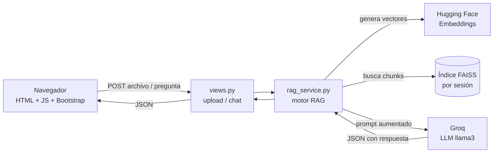

# Asistente RAG de Ciberseguridad

## Introducción

Asistente web que responde preguntas usando **únicamente** el contenido de un documento de ciberseguridad cargado por el usuario. Aplica reglas estrictas para evitar alucinaciones: si la respuesta no está en el documento, lo dice; si la pregunta o el documento no son de ciberseguridad, también.

**Lo que permite hacer:**

1. Subir un documento (PDF, TXT o MD) y consultarlo.
2. Ver el fragmento exacto del documento que se usó para responder (auditable).
3. Ejecutar una evaluación automática con 10 preguntas de rúbrica.

---

## Glosario

| Término | Definición |
|---|---|
| RAG | Retrieval-Augmented Generation. Técnica que combina búsqueda de información con generación de texto por un modelo de lenguaje. |
| LLM | Large Language Model. Modelo de lenguaje grande (en este proyecto, Groq con llama3). |
| Embedding | Representación numérica (vector) de un texto que captura su significado. |
| Chunk | Fragmento de texto en el que se divide un documento antes de indexarlo. |
| FAISS | Biblioteca de Meta para búsqueda eficiente en vectores. |
| API Key | Clave secreta que autentica al usuario ante un servicio externo. |
| Token | Equivalente a API Key en algunos servicios (Hugging Face usa "token"). |
| Terminal / CLI | Interfaz de línea de comandos donde se ejecutan instrucciones de texto. |
| Repositorio | Carpeta versionada con Git que contiene el código del proyecto. |
| Entorno virtual (venv) | Carpeta aislada con su propia versión de Python y dependencias. |
| Dependencias | Librerías externas que el proyecto necesita para funcionar. |
| Migración | Script que actualiza la estructura de la base de datos. |

---

## Tecnologías

| Tecnología | Qué es | Para qué se usa aquí |
|---|---|---|
| Python | Lenguaje de programación | Backend, scripts y automatización |
| Django | Framework web de Python | Vistas, rutas, sesiones y templates |
| SQLite | Base de datos local embebida | Base de datos por defecto de Django |
| Hugging Face | Hub de modelos | Descarga de embeddings multilingües |
| Groq | LLM en la nube | Genera respuestas con reglas de seguridad |
| LangChain | Framework para apps con LLMs | Orquesta la cadena RAG (loaders, splitter, prompts) |
| FAISS | Búsqueda vectorial de Meta | Indexa y recupera los chunks más relevantes |

## Herramientas

| Herramienta | Qué es | Para qué se usa aquí |
|---|---|---|
| Git | Sistema de control de versiones | Clonar y versionar el código |
| GitHub | Plataforma de hosting de repositorios | Donde vive el repositorio remoto |
| pip | Instalador de paquetes de Python | Instala las dependencias |
| Entorno virtual (venv) | Aislamiento de dependencias | Evita conflictos con otras instalaciones de Python |
| requirements.txt | Lista de dependencias | Define las librerías exactas a instalar |
| Variables de entorno | Configuración externa | Guarda credenciales sin exponerlas en el código |
| API Keys | Tokens de acceso | Permiten usar Groq y Hugging Face |
| Editor de código | Editor de texto/IDE | Para abrir y revisar el proyecto |

---

## Estructura del proyecto

```
DesarrolloDeAplicacionesConIA-2026-1-/
├─ ciber_rag/                # Configuración principal de Django (settings, urls, wsgi)
├─ rag_app/                  # Aplicación principal
│  ├─ templates/rag_app/     # HTML del frontend (base.html, index.html)
│  ├─ static/rag_app/css/    # Estilos CSS
│  ├─ migrations/            # Migraciones de la base de datos
│  ├─ rag_service.py         # Motor RAG + reglas de seguridad
│  ├─ views.py               # Vistas (controladores)
│  └─ urls.py                # Rutas de la aplicación
├─ scripts/                  # Scripts ejecutables
│  └─ evaluate_rubric.py     # Evaluación automática con 10 preguntas
├─ docs/                     # Documentos del proyecto y material de ciberseguridad
│  ├─ rubric_questions.txt   # 10 preguntas de rúbrica
│  └─ (archivos PDF, MD con material de ciberseguridad)
├─ db/                       # Índice FAISS (se genera en ejecución)
├─ ingest.py                 # Script alternativo de ingesta
├─ _init_.py                 # Script alternativo con Ollama (local)
├─ db.sqlite3                # Base de datos SQLite de Django
├─ manage.py                 # Comando principal de Django
├─ requirements.txt          # Dependencias del proyecto
├─ .gitignore                # Excluye env/ y .env del repositorio
└─ README.md                 # Esta documentación
```

---

## Arquitectura

El proyecto sigue una arquitectura de **tres capas** orquestadas por Django: cliente web, backend con el motor RAG y servicios externos para embeddings y generación.



**Componentes:**

- **Cliente (frontend):** templates Django (`base.html`, `index.html`) con JavaScript vanilla y Bootstrap 5. Maneja subida con drag-and-drop, render del chat e indicadores de carga.
- **Backend (Django):** vistas `index`, `upload_document` y `chat` en [rag_app/views.py](rag_app/views.py). El motor RAG vive en [rag_app/rag_service.py](rag_app/rag_service.py).
- **Persistencia local:** SQLite para la sesión Django (`db.sqlite3`); índice FAISS por sesión en `media/rag_sessions/<session_key>/faiss_index/`.
- **Servicios externos:** Hugging Face (embeddings multilingües) y Groq (LLM `llama-3.1-8b-instant`).

---

## Requisitos previos

1. **Python 3.10 o superior** instalado. Verificar con `python --version`.
2. **pip** disponible (viene con Python). Verificar con `pip --version`.
3. **Git** instalado. Verificar con `git --version`.
4. **Conexión a internet** (para descargar dependencias y modelos).
5. **Cuentas activas** en [Groq](https://console.groq.com) y [Hugging Face](https://huggingface.co) para obtener las API Keys.

---

## Guía de instalación y ejecución

Resumen del flujo:


> **A lo largo de todos los pasos usarás la terminal de tu sistema operativo.** Si no sabes cómo abrirla:
>
> - **Windows:** Menú Inicio → escribe "PowerShell" o "CMD" y presiona Enter. Alternativa: clic derecho dentro de la carpeta del proyecto → **"Abrir en Terminal"**. Si usas VS Code, abre la terminal integrada con `Ctrl + Ñ`.
> - **macOS:** `Cmd + Espacio` → escribe "Terminal" → Enter. O Aplicaciones → Utilidades → Terminal.
> - **Linux:** `Ctrl + Alt + T` en la mayoría de distribuciones.

### Paso 1. Instalar Python

Descarga Python desde [python.org/downloads](https://www.python.org/downloads/) y, durante la instalación en Windows, marca la opción **"Add Python to PATH"**.

Para verificar la instalación, abre la **terminal de tu sistema operativo** (ver la nota de arriba) y ejecuta:

```bash
python --version
```

### Paso 2. Descargar el proyecto

Tienes dos opciones:

**Opción A — Clonar con Git (recomendado):**

Verifica primero que Git esté instalado ejecutando `git --version` en la terminal del sistema operativo. Si no lo tienes, descárgalo desde [git-scm.com/downloads](https://git-scm.com/downloads). Luego clona el repositorio:

```bash
git clone URL_DEL_REPOSITORIO
```

Anota la ruta final donde se creó la carpeta del proyecto.

**Opción B — Descargar ZIP:**

1. En GitHub, abre el repositorio.
2. Haz clic en **Code → Download ZIP**.
3. Extrae el ZIP en una carpeta fácil de recordar.

### Paso 3. Abrir la terminal en la raíz del proyecto

Con la terminal del sistema operativo ya abierta, navega a la raíz del proyecto:

```bash
cd ruta/al/proyecto
```

**¿Cómo identificar la raíz del proyecto?** Es la carpeta que contiene `manage.py`, junto con las carpetas `ciber_rag/`, `rag_app/`, `docs/` y `scripts/`.

> Puedes abrir el proyecto en cualquier editor de código (VS Code, Sublime Text, Notepad++, PyCharm, etc.) o navegarlo desde el explorador de archivos. No hay un editor obligatorio.

### Paso 4. Crear y activar el entorno virtual

**¿Por qué es importante?** El entorno virtual aísla las dependencias de este proyecto del resto del sistema, evitando conflictos entre versiones.

**Windows (PowerShell):**

```powershell
python -m venv env
env\Scripts\Activate.ps1
```

**macOS / Linux:**

```bash
python3 -m venv env
source env/bin/activate
```

**¿Cómo saber si está activo?** Verás un prefijo `(env)` al inicio de cada línea de la terminal.

### Paso 5. Instalar dependencias

```bash
pip install -r requirements.txt
```

### Paso 6. Instalar FAISS

FAISS no se instala automáticamente con `requirements.txt` porque depende del hardware. Instálalo según tu equipo:

```bash
pip install faiss-cpu
```

Si tienes una GPU NVIDIA con CUDA y prefieres acelerar la indexación:

```bash
pip install faiss-gpu
```

> Si al subir un documento en la interfaz ves el error `Could not import faiss Python package`, significa que este paso quedó pendiente. Ejecuta uno de los dos comandos anteriores y reinicia el servidor.

### Paso 7. Crear el archivo `.env`

**¿Qué es un archivo `.env`?** Es un archivo de texto que guarda variables sensibles como API Keys. **Nunca** se sube al repositorio.

1. En la raíz del proyecto (la carpeta que contiene `manage.py`), crea un archivo llamado exactamente `.env`.
2. En Windows, activa la **vista de extensiones de archivo** para asegurarte de que no quede como `.env.txt`.
3. Pega este contenido y reemplaza los valores con tus claves reales:

```env
GROQ_API_KEY=tu_clave_de_groq
HF_TOKEN=tu_token_de_huggingface
```

### Paso 8. Ejecutar migraciones de la base de datos

```bash
python manage.py migrate
```

Esto inicializa la base de datos SQLite (`db.sqlite3`) que usa Django para sesiones.

### Paso 9. Iniciar el servidor

```bash
python manage.py runserver
```

En la terminal verás algo como:

```
Starting development server at http://127.0.0.1:8000/
```

Abre esa URL en tu navegador. Para detener el servidor presiona `Ctrl + C` en la terminal.

---

## Cómo obtener las API Keys

### Groq API Key (LLM)

1. Entra a [console.groq.com](https://console.groq.com).
2. Crea una cuenta o inicia sesión.
3. Ve a **API Keys** y crea una nueva.
4. Copia la clave y pégala en `.env` como `GROQ_API_KEY`.

### Hugging Face Token (embeddings)

1. Entra a [huggingface.co](https://huggingface.co) e inicia sesión.
2. Ve a tu perfil → **Settings → Access Tokens**.
3. Crea un token con permisos **Read**.
4. Copia el token y pégalo en `.env` como `HF_TOKEN`.

---

## Base de datos

**¿Qué base de datos usa el proyecto?**

SQLite, almacenada localmente en `db.sqlite3`. No requiere servidor adicional y es ideal para entornos de desarrollo y prototipos.

**¿Cómo se inicializa?**

Ya quedó cubierto en el **paso 8** del flujo (`python manage.py migrate`).

---

## Cómo funciona el motor RAG

El motor combina **ingesta**, **vectorización**, **recuperación** y **generación aumentada** en una sola cadena por sesión de usuario. Cada usuario tiene su propio índice aislado.

### Proceso de ingesta

Cuando el usuario sube un archivo (PDF, TXT o MD):

1. **Validación**: se verifica que la extensión esté en `SUPPORTED_EXTENSIONS = {".pdf", ".txt", ".md"}`.
2. **Guardado por sesión**: el archivo se almacena en `media/rag_sessions/<session_key>/` para aislar las cargas entre usuarios.
3. **Carga del contenido**:
   - PDFs: `PyPDFLoader` de LangChain (extrae texto página por página).
   - TXT / MD: `TextLoader` con encoding UTF-8.
4. **División en chunks**: `RecursiveCharacterTextSplitter` con `CHUNK_SIZE = 1000` caracteres y `CHUNK_OVERLAP = 150`. El overlap evita perder contexto en los límites entre chunks.

Implementación: [rag_app/rag_service.py](rag_app/rag_service.py) (`load_documents`, `split_documents`, `build_vector_store`).

### Vectorización

Cada chunk se convierte en un **vector numérico** que captura su significado semántico:

- **Modelo de embeddings**: `sentence-transformers/paraphrase-multilingual-MiniLM-L12-v2`, descargado desde Hugging Face.
- **Por qué multilingüe**: el material puede estar en español o inglés; el modelo maneja ambos sin tener que traducir.
- **Almacenamiento**: los vectores se guardan en un índice **FAISS** local por sesión (`faiss_index/`). FAISS hace búsqueda por similitud de forma eficiente.

Cuando llega una pregunta:

1. La pregunta se convierte en vector usando el mismo modelo.
2. FAISS recupera los **`k=4` chunks** más similares.
3. Los chunks recuperados se concatenan como `CONTEXTO`.

### Construcción del prompt aumentado

El prompt enviado a Groq combina **tres bloques** que llegan al modelo en un único mensaje:

```
[SYSTEM_PROMPT con las reglas de oro]

PREGUNTA: {pregunta del usuario}

MUESTRA_DOCUMENTO:
{primeros 1200 caracteres del contexto}

CONTEXTO:
{los 4 chunks recuperados}
```

El **SYSTEM_PROMPT** instruye al modelo para que actúe como un verificador estricto y responda **únicamente en JSON** con cuatro campos:

```json
{
  "doc_is_cybersecurity": true,
  "question_is_cybersecurity": true,
  "answer_in_context": true,
  "answer": "Texto de la respuesta basada en el contexto"
}
```

Las reglas de oro que aplica el LLM, en orden:

1. **¿La MUESTRA_DOCUMENTO trata sobre ciberseguridad?** Si no es claro, marcar `false`.
2. **¿La PREGUNTA es sobre ciberseguridad?**
3. **¿El CONTEXTO contiene la respuesta exacta?**

Luego, [rag_service.py](rag_app/rag_service.py) (`run_guarded_answer`) parsea el JSON y aplica la lógica final:

- Si `doc_is_cybersecurity == false` **o** `question_is_cybersecurity == false` → devuelve la respuesta oficial de no-ciberseguridad.
- Si `answer_in_context == false` → devuelve la respuesta oficial de sin-contexto.
- Solo si los tres son `true` se devuelve la respuesta generada por el modelo.

El modelo de Groq usado es `llama-3.1-8b-instant` (configurable con la variable de entorno `GROQ_MODEL`) con `temperature=0.2` y `max_tokens=700` para favorecer respuestas deterministas y concisas.

### Reglas de seguridad y respuestas oficiales

1. Si el documento o la pregunta **no son** de ciberseguridad, el sistema responde:

   ```
   Lo siento soy un modelo entrenado para resolver dudas concretas de documentos concretos de CIBERSEGURIDAD
   ```

2. Si la respuesta **no está** en el contexto del documento, el sistema responde:

   ```
   No encuentro esa información en el reglamento
   ```

---

## Ejecutar la evaluación de rúbrica

1. Abre `docs/rubric_questions.txt` y verifica que tenga 10 preguntas (una por línea).
2. Desde la raíz del proyecto, ejecuta:

   ```bash
   python scripts/evaluate_rubric.py
   ```

3. Los resultados se generan en:
   - `reports/rubric_results.json`
   - `reports/rubric_results.csv`

---

## Informe de resultados

Al ejecutar el script de evaluación, el sistema carga todos los documentos de `docs/`, construye un índice FAISS **en memoria** y procesa las 10 preguntas de `docs/rubric_questions.txt`. Para cada pregunta produce un registro auditable.

**Archivos generados** (`reports/`):

- `rubric_results.json` — array de objetos, uno por pregunta. Útil para revisar caso por caso o procesar programáticamente.
- `rubric_results.csv` — la misma información en formato tabular. Útil para abrir en Excel o Google Sheets.

**Campos de cada registro:**

| Campo | Descripción |
|---|---|
| `question` | La pregunta evaluada. |
| `answer` | La respuesta final entregada al usuario (incluye las respuestas oficiales si aplicó alguna regla). |
| `doc_is_cybersecurity` | Booleano. `true` si el LLM consideró que el corpus es de ciberseguridad. |
| `question_is_cybersecurity` | Booleano. `true` si el LLM consideró que la pregunta es de ciberseguridad. |
| `answer_in_context` | Booleano. `true` si el LLM encontró la respuesta en los chunks recuperados. |
| `chunks_indexed` | Total de chunks creados a partir de los documentos cargados. |
| `source` | Fragmento exacto del documento usado como evidencia (auditable). |

**Cómo interpretar los resultados:**

- Una respuesta **correcta** tiene los tres booleanos en `true` y `source` con el fragmento que la sustenta.
- Una respuesta oficial de **"no es ciberseguridad"** indica que la pregunta o el documento no pasaron el filtro temático.
- Una respuesta oficial de **"no encuentro esa información"** indica que la pregunta es válida pero el contexto recuperado no la contiene; sirve para identificar lagunas en el material.

---

## Errores comunes y soluciones

### Python no reconocido

**Síntoma:** `python` no se reconoce como comando.

**Solución:** Instala Python desde [python.org/downloads](https://www.python.org/downloads/) y marca **"Add Python to PATH"** durante la instalación.

### pip no reconocido

**Síntoma:** `pip` no se reconoce como comando.

**Solución:** Ejecuta `python -m pip --version`. Si falla, reinstala Python asegurando que pip esté incluido (es la opción por defecto).

### Entorno virtual no activo

**Síntoma:** No aparece `(env)` al inicio de la línea en la terminal.

**Solución:** Activa el entorno con el comando correspondiente a tu sistema (ver paso 4).

### Falta archivo `.env` o variables

**Síntoma:** Error `Falta la variable de entorno GROQ_API_KEY`.

**Solución:** Crea `.env` en la raíz del proyecto y agrega `GROQ_API_KEY` y `HF_TOKEN` con valores válidos.

### API Key inválida

**Síntoma:** Errores de autenticación o respuestas vacías.

**Solución:** Verifica que la clave esté completa, sin espacios al inicio o al final, y que pertenezca a tu cuenta activa.

### Error de FAISS al subir documento

**Síntoma:** `Could not import faiss Python package`.

**Solución:** Ejecuta `pip install faiss-cpu` (o `faiss-gpu` si tienes GPU NVIDIA). Reinicia el servidor después.

### Puerto ocupado

**Síntoma:** `Address already in use`.

**Solución:** Inicia el servidor en otro puerto:

```bash
python manage.py runserver 8001
```

### Dependencias faltantes

**Síntoma:** `ModuleNotFoundError`.

**Solución:** Asegúrate de tener el entorno virtual activo y ejecuta:

```bash
pip install -r requirements.txt
```

---

## Seguridad de credenciales

1. Nunca publiques el archivo `.env`.
2. Nunca subas API Keys a GitHub.
3. Si compartes el proyecto, elimina las credenciales antes.

---

## Soporte rápido (orden de verificación)

1. Entorno virtual activo (`(env)` visible).
2. `.env` creado con claves válidas.
3. Dependencias instaladas (`pip install -r requirements.txt`).
4. FAISS instalado (`pip install faiss-cpu`).
5. Migraciones ejecutadas (`python manage.py migrate`).

---

## Autora

Lina Andrea Bello Ballén
